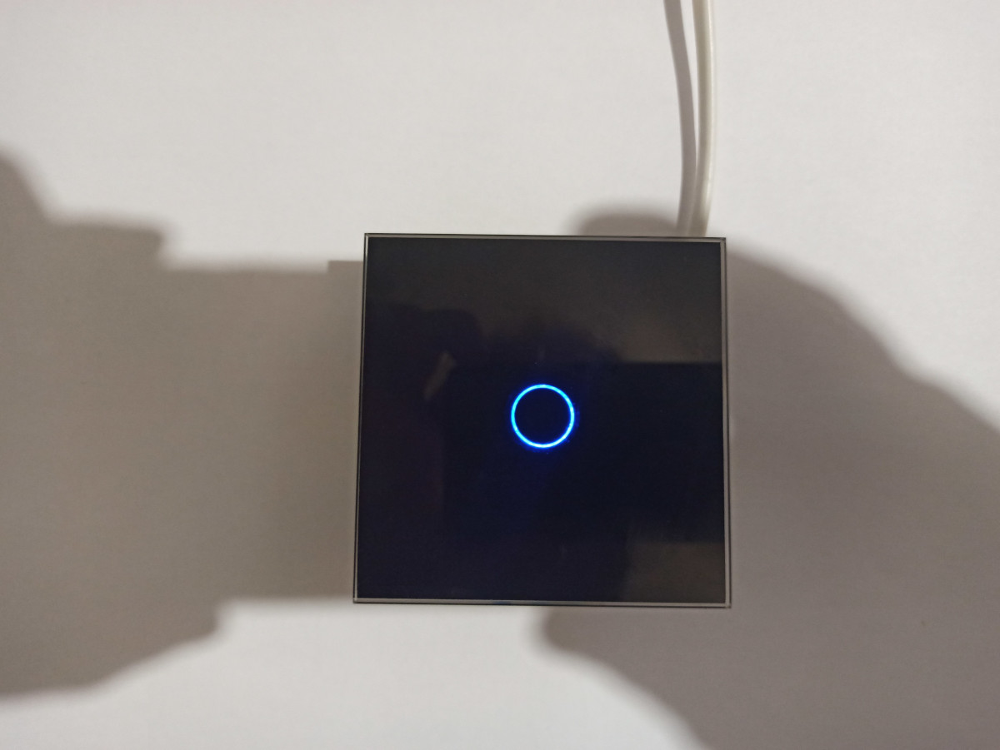

# Datcha

Smart home project for small house. House is located is rather far from civilisation. The internet is bad so the control will be done by sending SMS.
The main tasks:
* Control heaters (on/of, keep temperature)
* Remove water from the systems in case if temperature < 5 C.
* Light control (optional)

Hardware
--------
All controllers based on esp8266. Server based on esp32.  

