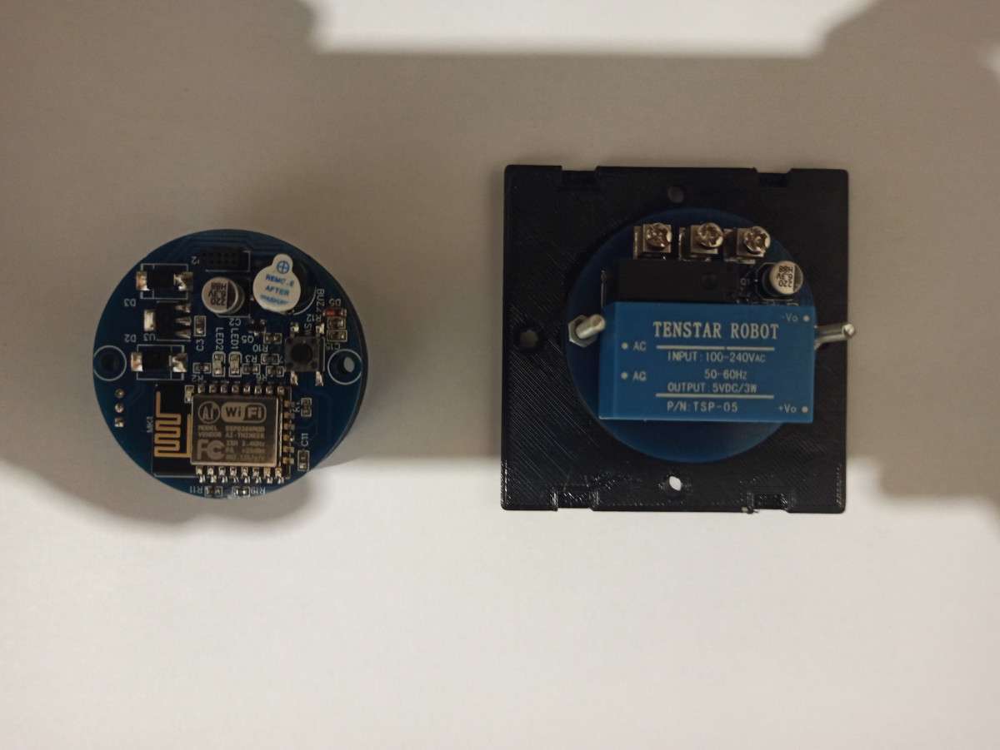

# Datcha

Smart home project for small house. House is located is rather far from civilisation. The internet is bad so the control will be done by sending SMS.
The main tasks:
* Control heaters (on/of, keep temperature)
* Remove water from the systems in case if temperature < 5 C.
* Light control (optional)

Hardware
--------
All controllers based on esp8266. Server based on esp32.

Cases for WiFi switch can be found in WiFiSwitch\case. Provided FreeCad and stl files for 3D Printing. It's not neccessary to print with high quality. Layer 0.2 mm and fill with 40% is enougnt. I print cases at high speed (as much as my printer can print without distortions). I used PETG for printing. If you will use other materials please scale models according shrinkage.

Circuits diagramm can be found at https://easyeda.com/mmaygli/wifiswitchcontroller , https://easyeda.com/mmaygli/wifiswitchpower, https://easyeda.com/mmaygli/ttp223_sensor-fb61dc2f75424c1baff6515b785d2cc1 (V2 is tested and works ok)

Firmware
--------
Can be found at WiFiSwitch/firmware. Consist of two parts. Firmware itself (folders main and components). This part is written in C language under Espressif IDF. Second part is WebApplication (folder WiFiSwitch/firmware/data). It is too slow to debug Web application using esp microcontroller so http server based on node.js and express was implemented (folder WiFiSwitch/firmware/debug/nodejs_server)

